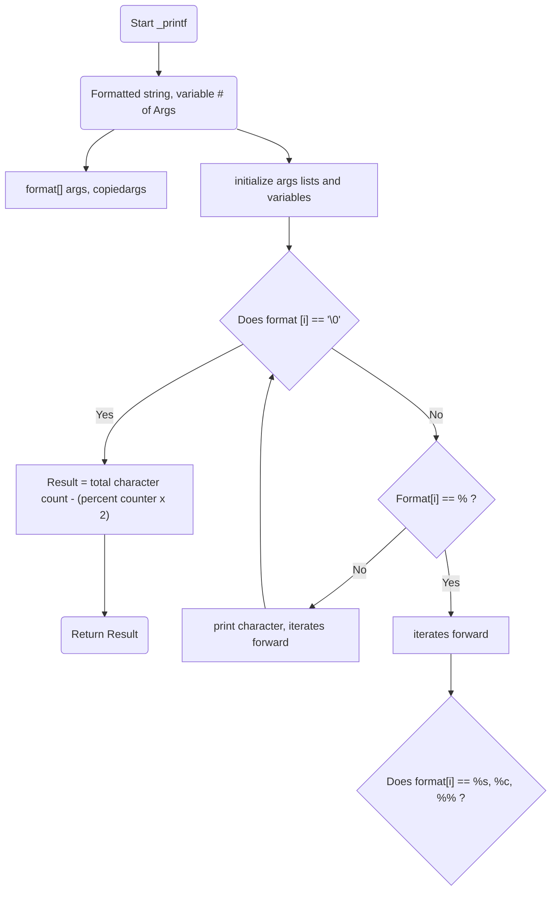

# Atlas-printf

## Synopsis

This is a simple version of the printf function found in the standard library of the C programming language. 
Available Conversion specifiers:
%c: Prints a single character
%s: Prints a string of characters 
%d: Prints integers 
%i: Prints integers.
%%: Prints Literal ‘%’

## Description
This version of printf uses variadic functions, structs, and multiple helper functions to print inputed characters, strings, percent signs, integers, and decimals. When executed successfully, it will also return the number of characters printed. If it fails, it will return a "-1".

## File Names and Descriptions
### 1_printf.c
Declares a the function that takes a string argument called format. It iterates through the format string, handles specific format specifiers, and calculates the number and characters printed before returning the result.
### 2-get_spec_func.c
Acts as a lookup table for format specifiers. It searches an array named “specs” to find the function pointer that corresponds to the given character ‘s’. Once the function pointer is found, it is used to call the appropriate function based on the format specifier.
### 3-print_functions.c
Contains the helper functions that print the data based off the corresponding format specifier.
### 4-char_counter.c
Uses 5-strlen.c to calculate the total number of characters in the variadic arguments.
### 5-strlen.c
Contains a helper function that returns the length of a string, which is then used in 4-char_counter.c
### main.h
Header file containing all prototype functions and the specifier struct.
### man-3_printf
Man page
## Flowchart

## Authors
Michael Ballou, Harrison Gearhart
